# DOM - Document Object Model

The Document Object Model (DOM) is a programming interface for web documents. It represents the structure of HTML or XML documents as a tree of objects, allowing JavaScript and other languages to dynamically interact with and modify the content, structure, and style of web pages. 

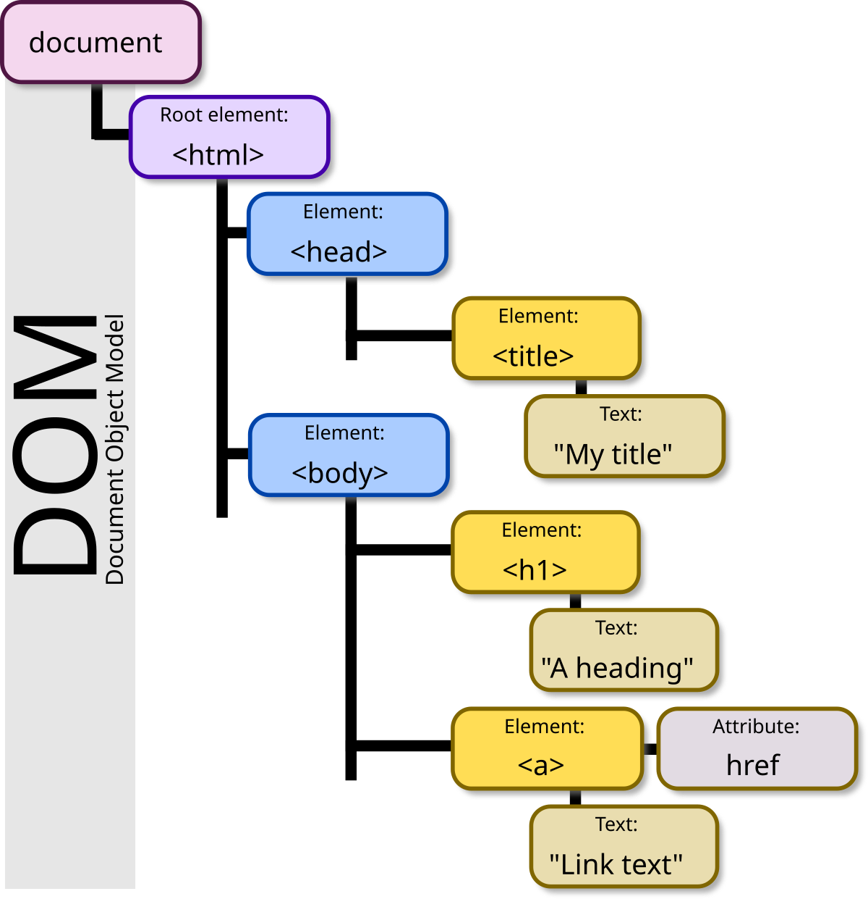

lets explore the console a little bit here

lets first `console.log(window)`

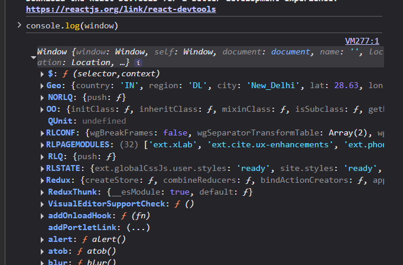

Using this in console we will get a dense object of window which can be furthur expolored as per requirement but currently we are more interested in `document` and document is inside the window as it is the starting point of the tree so we can simply write 

`console.log(window.document)`
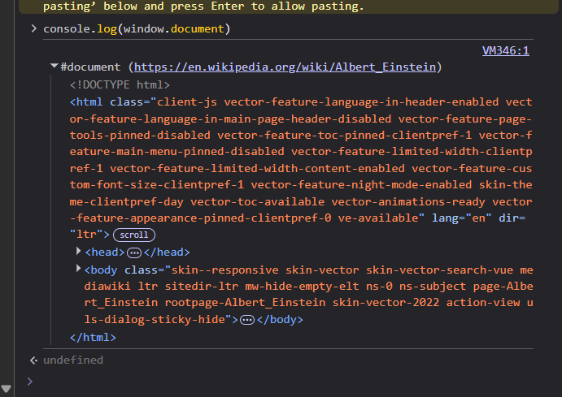
Now we have the document tree. this is giving us the HTML elements and tags where we will bve directing our focus primiarily.

as this specific document object is used very often so the browser knows about that so we can also write `console.log(document)` and it will work. 

we can also explore different aspects of the document using different commands for eg `console.dir(document)`
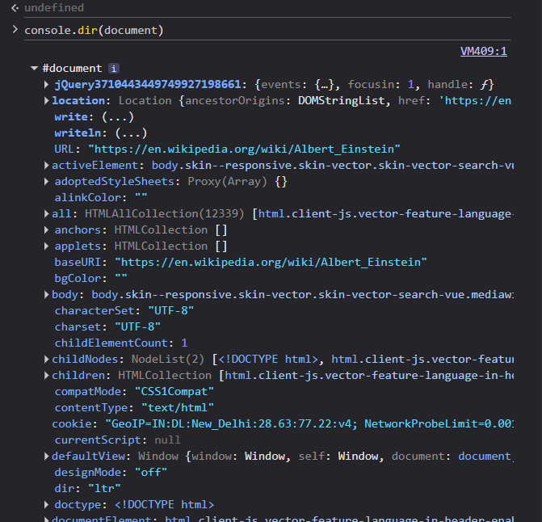

this all is represented in Tree Format in a clean heirarchical structure. 

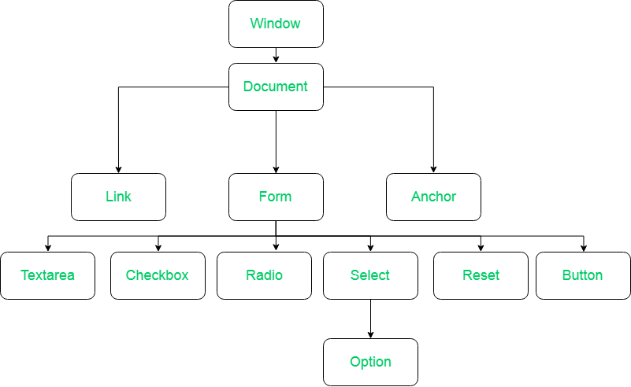

[DOM Tree Model Explained Article | Medium](https://medium.com/@abdelrahmansalembakry_28951/nodes-types-and-their-dom-document-object-model-explanation-in-depth-719cca351846)

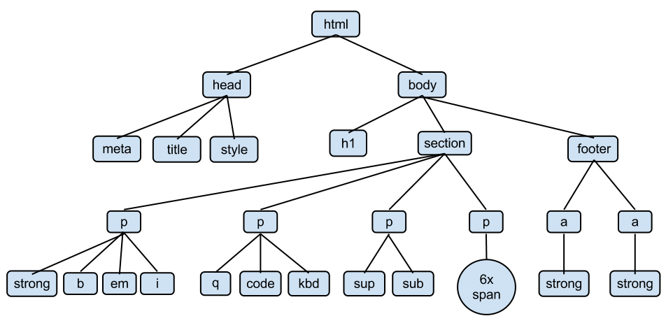

We can explore the document even furthur by applying `.` after the document. 
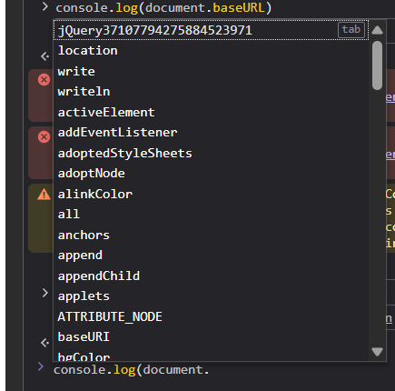

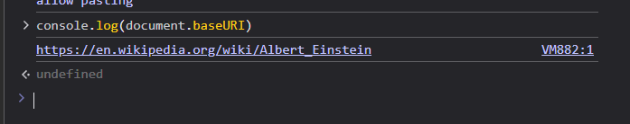
baseURI

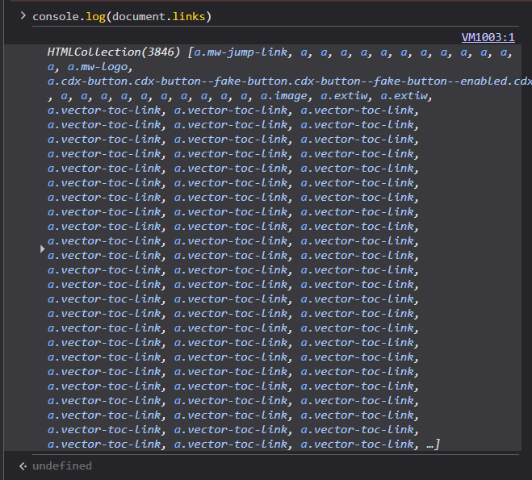
Collection of links

> Important thing here is to understand the difference between Object Collections (HTML Collections, Node Collections), Arrays. understanding what we are getting is important so we can handle those with appropriate function for eg if we assumen HTML collections to be Arrays and started applying Foreach it will give error and we will be confused so understanding this is important and we can convert any collection or object to array so we can get benefit of these functions but for that we need to know the difference. 

### There are selectors element in DOM
> if you dont know what elements name is or which ID or Class should i use to select if use 
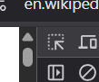 
To hover and click on the element you need to select and you will get the info about what its class or Id name is and where in the dom tree does it lie. 
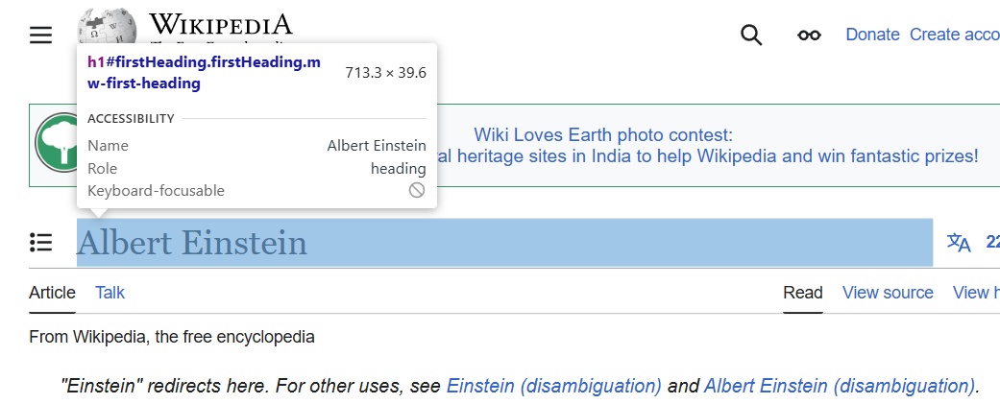
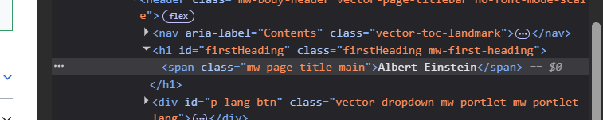
we can select the h1 element and replace it using its id name as firstHeading and to do that we can use a document selector. 

`document.getElementById('firstHeading')`
this is used to select an element by its id

`document.getElementById('firstHeading').innerHTML = "<h1>Chai aur code</h1>"`
this is used to replace the contents of the element which was selected by id