# All DOM selectors NodeList and HTMLCollection 

we will learn about how we can capture elements and how we can manipulate them as well as what we can use to do these things.

> important thing here is that in JS everything like attacking/ capturing and element is done by us manually which any library like React does on its own in the backend. this is core implementation using JS.

## We have different Selectors depending on the requirement.

We should also know the inner structure of the Selectors 

for eg we have a selector `getElementById('title')` 
but we wants its class name to access that we wont use `.class` but rather `.className`.
always explore as the property might exist but you might not know what is is called 
`getElementById('title').className`

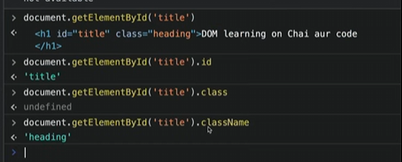
Even in `JSX` we use the keyword className even though as a concept it is referered here and there as a class. `since class is a reserved keyword in JS and JSX`

### 🔧 DOM Selectors and Their Key Properties

| **Selector Method**               | **Returns**                      | **Common Properties & Usage**                                                            |
| --------------------------------- | -------------------------------- | ---------------------------------------------------------------------------------------- |
| `getElementById('id')`            | Single Element (`HTMLElement`)   | `.id`, `.className`, `.innerText`, `.textContent`, `.style`, `.innerHTML`, `.attributes` |
| `getElementsByClassName('class')` | HTMLCollection (array-like)      | `[0].className`, `[0].style`, use `for...of` or spread to loop                           |
| `getElementsByTagName('tag')`     | HTMLCollection                   | Same as above, but selected by tag name like `'div'`, `'p'`                              |
| `querySelector('selector')`       | First match (`HTMLElement`)      | Same properties as `getElementById`                                                      |
| `querySelectorAll('selector')`    | NodeList (static array-like)     | Use `forEach`, or spread into array for map/filter                                       |
| `document.body`                   | Body element                     | `.innerHTML`, `.style`, etc.                                                             |
| `document.documentElement`        | `<html>` root element            | `.scrollTop`, `.scrollHeight`, etc.                                                      |
| `element.children`                | HTMLCollection of child elements | `.length`, indexed access                                                                |
| `element.parentElement`           | Parent `HTMLElement`             | Useful for traversing up                                                                 |
| `element.nextElementSibling`      | Next sibling `HTMLElement`       | For DOM traversal                                                                        |
| `element.previousElementSibling`  | Previous sibling                 | DOM traversal                                                                            |

---

### 🔑 Common Properties You’ll Use

| **Property**   | **What It Does**                                                            |
| -------------- | --------------------------------------------------------------------------- |
| `.id`          | Get/set the element's ID                                                    |
| `.className`   | Get/set all class names as a string (`"btn primary"`)                       |
| `.classList`   | Provides methods like `.add()`, `.remove()`, `.toggle()`, `.contains()`     |
| `.textContent` | Get/set all the text inside the element, excluding inner tags               |
| `.innerText`   | Like `textContent` but rendered appearance-wise (e.g., ignores hidden text) |
| `.innerHTML`   | Get/set HTML inside the element                                             |
| `.outerHTML`   | Entire element as HTML (not usually edited)                                 |
| `.style`       | Inline styles as an object (`element.style.color = 'red'`)                  |
| `.attributes`  | NamedNodeMap of all attributes                                              |
| `.dataset`     | Access custom `data-*` attributes as `element.dataset.name`                 |

### We can also do styling in DOM

> This is not a great practice but it can be done.

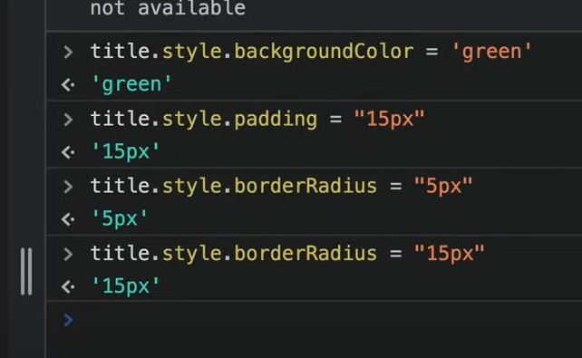

### How content can be extracted and Inputted

few examples are: 
`title.textContent`
`title.innerHTML`
`title.innerText`
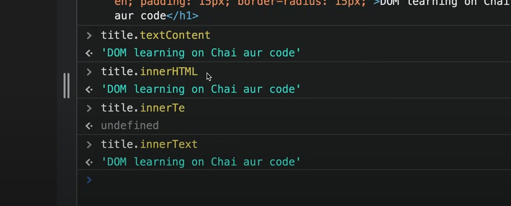

All of these (innerHTML, innerText, textContent) are giving same value but they are different. but how ?

innerHTML is easy to distingush 
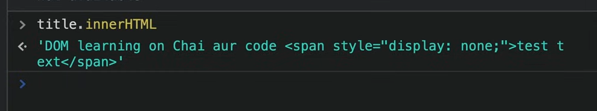
it returns text as well as tags

lets see difference between innerText and textContent

``` HTML
    <h1 id = "title" class = "heading">
        DOM learning on chai aur code <span style="display: none;"> test text </span>
    </h1>
```
to do that we will add a span of display: none

and this is the output


so textContent displays everything and innerText displays only what is visible to the user.

#### Query Selector

There are two types primarily `querySelector()` and `querySelectorAll()`
* The Document method `querySelector()` returns the first Element within the document that matches the specified CSS selector, or group of CSS selectors. If no matches are found, null is returned.
[returns the first element which meets the condition. this has similar syntax to JQuery]
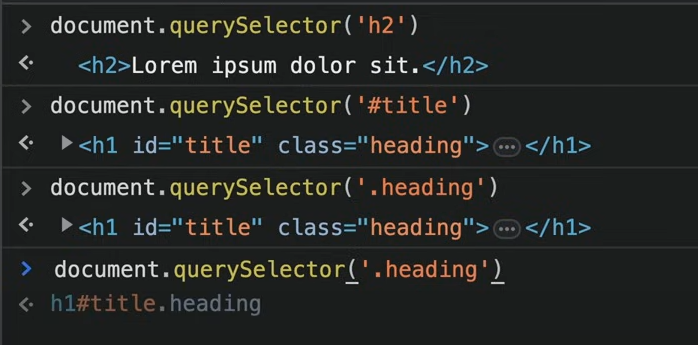
Here you need knowledge of CSS selector to do these properly like using # for class and . for id etc

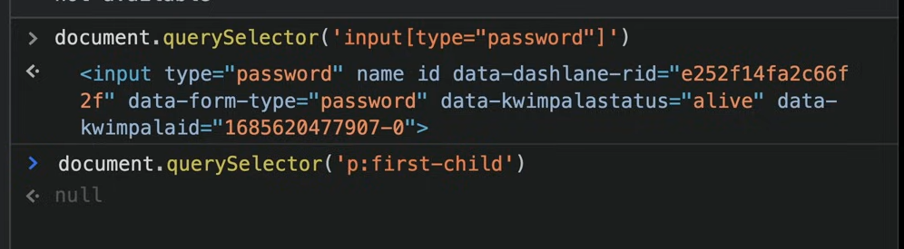

we can select tags also like calling directly the element `ul`
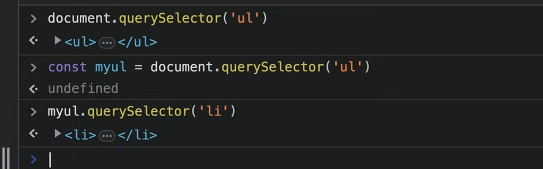

we can also do CSS in selectors 
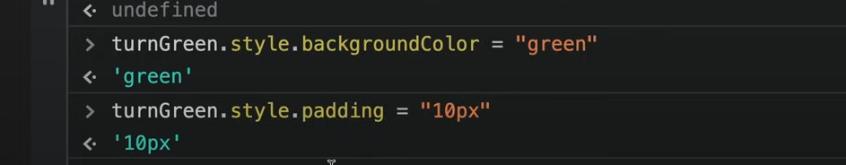

* The Document method `querySelectorAll()` returns a static (not live) NodeList representing a list of the document's elements that match the specified group of selectors.


#### Difference between NodeList and HTMLCollections and Array.
understand this that if I open up the NodeList object I am able to see what function are there in its prototype those can be use and there are different function that are present in different NodeList or HTMLCollections or Array

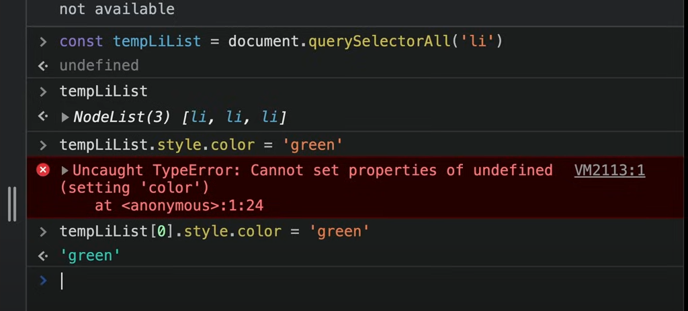
NodeList is similar to Array but not array.
there is map in array but not in NodeList. so we use ForEach there

but if there is a requirement we can convert NodeList to Array. 

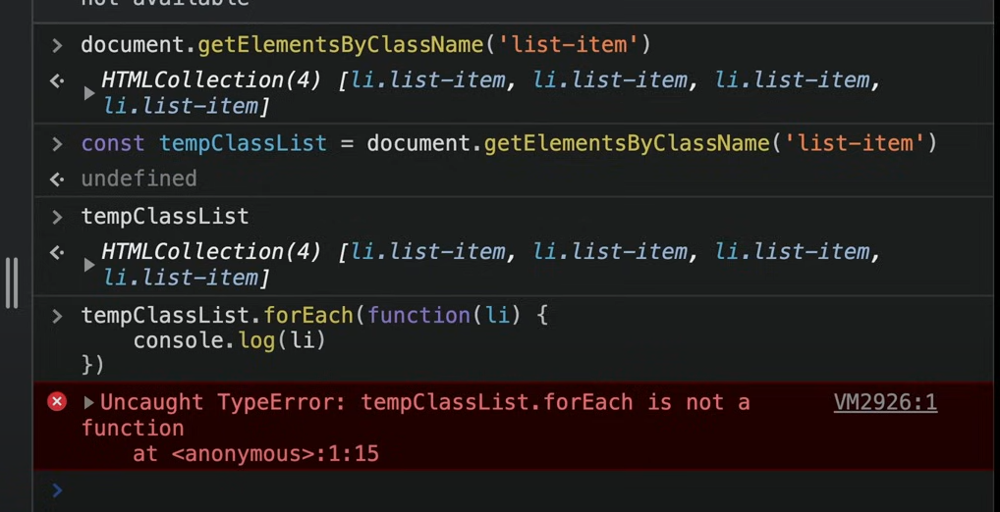
we cannot use ForEach 

so we will try to convert NodeList to Array
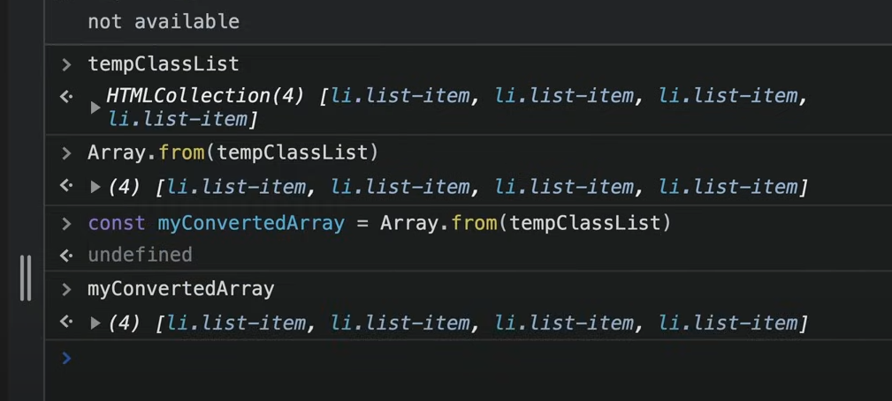

#### Usecase of each Selector pros cons undertand then properly

