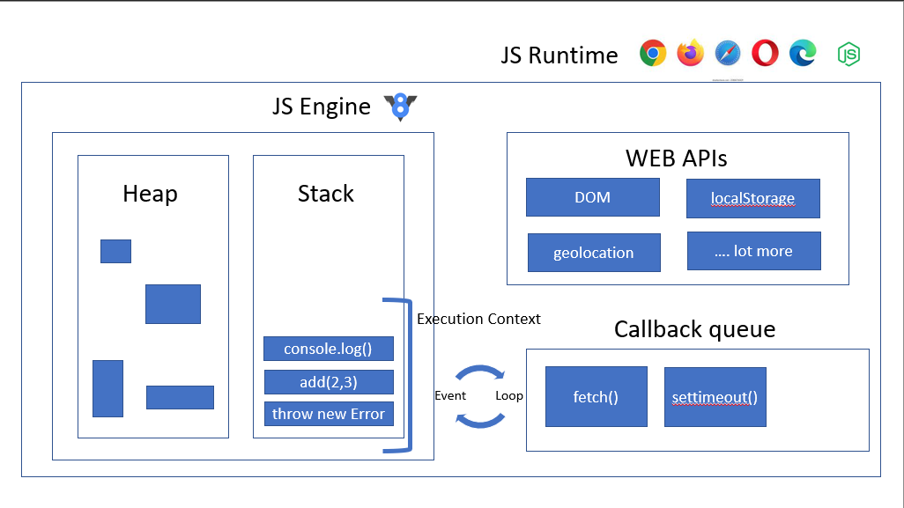

# ASYNC JAVASCRIPT FUNDAMENTALS 
Lecture no : 37

## JAVASCRIPT

Javascript is by default Synchronus as well as it is Single threaded. IF we run the Javascript in only its engine then we can encounter the problem with single threadedness but this never happens we always find the javascript alone. we always use it in a run time enviornment. which handles this and we never faces the problem even though it is single threaded. 

## EXECUTION CONTEXT 

* Line is executed one by one at a time
* Each operation waits for the last one to complete before executing 
* CALL STACK AND MEMORY HEAP 

## BLOCKING CODE VS NON BLOCKING CODE

this is synchronous and non - synchronous.

### BLOCKING CODE
* blocking the flow of the program. this will wait.
* Read File Sync (when we are reading the file synchronlusly. generally JS cannot do it we need node for that JS in browser alone cant handle it. but reading like this create a problem as it is waiting to recieve the file no other execution can take place).
* If we are handling a DB (basically a file) then we dont want the async or non blocking behaviour. as we dont want saved in DB (next line of code or execution) before the Read File 

### NON BLOCKING CODE
* Doesn't block execution 
* Read the File Async (this is better in this situation but not always).

They both have different use cases. none is always prefered. 

